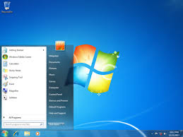
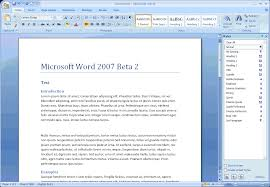

```{r setup, include=FALSE}
knitr::opts_chunk$set(echo = FALSE)
```

```{r carga}
msft <- read.csv("http://ichart.finance.yahoo.com/table.csv?s=MSFT", sep=',', header=1)
```


## A Microsoft

Microsoft Corporation (NASDAQ: MSFT) é uma empresa americana com sede em Redmond, Washington, fundada por Bill Gates e Paul Allen em 4 de abril de 1975, atualmente
presidida por Satya Nadella.

- À esquerda: Paul Allen e Bill Gates.
- À direita: O CEO Satya Nadella


## Software

Entre seus produtos de software mais conhecidos estão as linhas de sistemas operacionais Windows, a linha de aplicativos para escritório Office e o navegador Internet Explorer. 

É a maior produtora de softwares do mundo por faturamento, e uma das empresas mais valiosas do mundo. <br><br><br>





## Hardware

Entre seus principais produtos de hardware estão os consoles de videogame Xbox, a série de tablets Surface e os Smartphones Microsoft Lumia, antiga Nokia.<br><br><br><br><br><br>


## IPO NASDAQ

Em 1986 a Microsoft fez uma oferta pública de ações na bolsa NASDAQ,
com o preço de US$21,00 por ação. No fim do dia cada papel valia 
US$27,00.

Em Janeiro de 2003, pela primeira vez, a Microsoft ofereceu dividendos
pelos seus papéis.

Entre 1986 e 2016 a empresa fez diversos **splits** no preço das ações,
que podem ser vistos como mudanças bruscas no preço.


## Histórico de Splits (1/2)

| Data       | Taxa    |
|:-----------|:--------|
| 21/09/1987 | 2 por 1 |
| 16/04/1990 | 2 por 1 |
| 27/06/1991 | 3 por 2 |
| 15/06/1992 | 3 por 2 |
| 23/05/1994 | 2 por 1 |


## Histórico de Splits (2/2)

| Data       | Taxa    |
|:-----------|:--------|
| 09/12/1996 | 2 por 1 |
| 23/02/1998 | 2 por 1 |
| 29/03/1999 | 2 por 1 |
| 18/02/2003 | 2 por 1 |


```{r por_ano, echo=FALSE, results='asis'}
Ano <- format(as.Date(msft$Date), format="%Y")
msft <- cbind(msft, Ano)
Mes <- format(as.Date(msft$Date), format="%m")
msft <- cbind(msft, Mes)
library(lattice)
for (y in (1986:2016)) {
  cat(paste("## Preço em ", y, " (em US$)"))
  cat('\n\n')
  print(barchart(Close ~ Mes | Ano, data=msft[which(msft$Ano == y), ]))
  cat('\n\n')
}
```


## Referências

- <https://pt.wikipedia.org/wiki/Microsoft>.
- <https://en.wikipedia.org/wiki/Microsoft>
- <https://www.microsoft.com/en-us/Investor/company-overview.aspx>
- <http://www.nasdaq.com/symbol/msft>
- <http://money.cnn.com/quote/quote.html?symb=MSFT>
- <https://www.stocksplithistory.com/microsoft/>